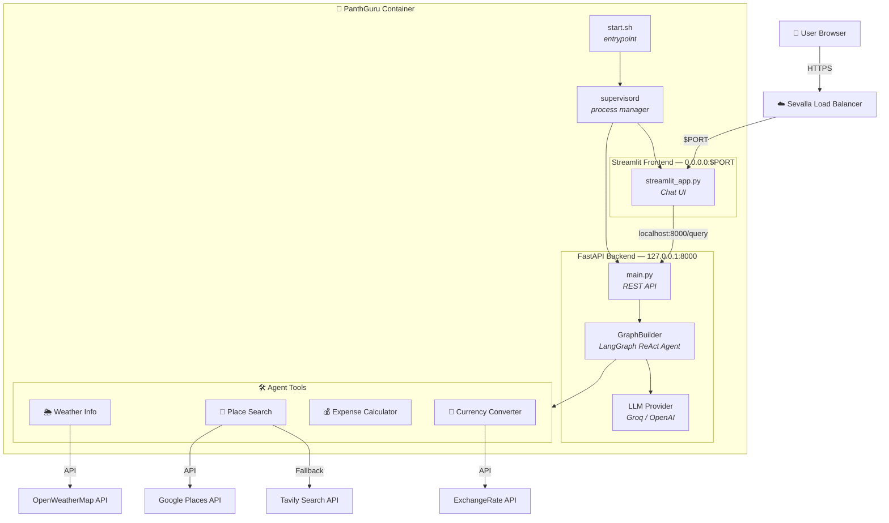
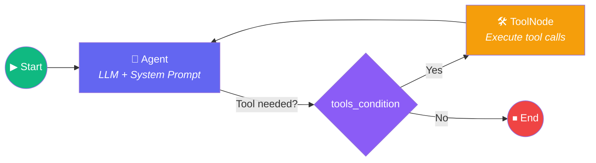
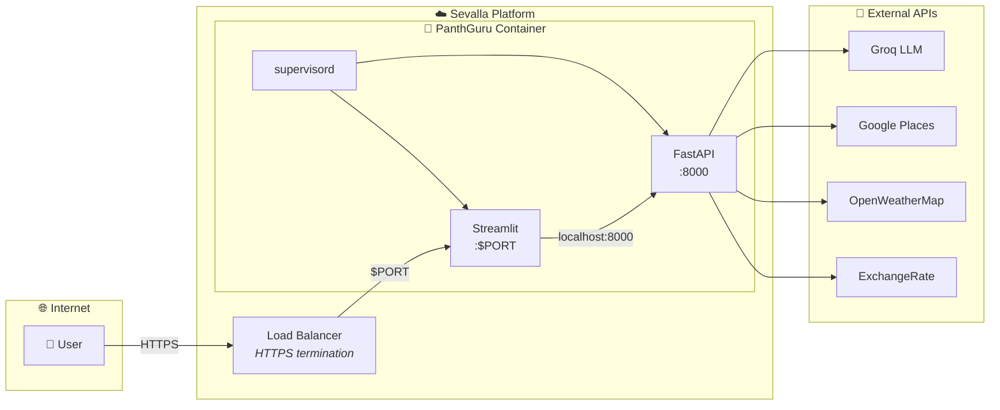

<p align="center">
  <h1 align="center">🕉️ PanthGuru — AI Travel Planner</h1>
  <p align="center">
    <i>पन्थगुरु — "The Path Guide"</i><br/><br/>
    An AI-powered agentic travel planner rooted in the spirit of ancient Indian exploration. PanthGuru builds comprehensive, day-by-day trip itineraries with real-time weather, places, expense estimates, and currency conversions — all through a conversational Streamlit interface.
  </p>
</p>

<p align="center">
  
  
  
  
  
  
  
</p>

---

## ✨ Features

| Feature | Description |
|---------|-------------|
| 🤖 **Agentic AI Workflow** | Uses LangGraph's ReAct agent pattern — the LLM autonomously decides which tools to invoke based on your query |
| 📍 **Place Discovery** | Finds top attractions, restaurants, activities, and transport options via Google Places API with Tavily as fallback |
| 🌦️ **Real-Time Weather** | Fetches current conditions and multi-day forecasts from OpenWeatherMap |
| 💰 **Expense Calculator** | Estimates hotel costs, daily budgets, and total trip expenses |
| 💱 **Currency Conversion** | Converts costs between 150+ currencies in real-time via ExchangeRate API |
| 📋 **Detailed Itineraries** | Generates day-by-day plans with both popular tourist and off-beat recommendations |
| 🖥️ **Chat Interface** | Beautiful Streamlit UI with a dark theme and conversational input |
| 🐳 **Docker Ready** | Multi-stage Dockerfile with supervisord for single-container deployment on Sevalla |

---

## 🏗️ Architecture

The application follows a **split architecture** — a FastAPI backend handles the AI agent logic, while a Streamlit frontend provides the user interface. Both run inside a single Docker container managed by **supervisord**.

### High-Level Architecture



### Agent Decision Flow



The LangGraph agent uses a **ReAct (Reasoning + Acting)** loop:
1. The user's travel query enters the agent
2. The LLM reasons about which tools to call (weather, places, calculator, currency)
3. Tools execute and return results to the agent
4. The agent reasons again — calling more tools if needed
5. Once satisfied, the agent generates the final comprehensive travel plan

---

## 📁 Project Structure

```
PanthGuru/
├── main.py                     # FastAPI backend — /query endpoint
├── streamlit_app.py            # Streamlit frontend — chat UI
├── Dockerfile                  # Multi-stage Docker build for Sevalla
├── supervisord.conf            # Process manager for FastAPI + Streamlit
├── start.sh                    # Container entrypoint script
├── requirement.txt             # Python dependencies
├── .env                        # API keys (local only — never commit!)
├── .dockerignore               # Files excluded from Docker image
├── .gitignore                  # Files excluded from Git
├── Procfile                    # Alternative deployment config
├── runtime.txt                 # Python runtime version
├── setup.py                    # Package setup
├── pyproject.toml              # Project metadata
│
├── agent/
│   └── agentic_workflow.py     # LangGraph ReAct agent — graph builder
│
├── tools/
│   ├── weather_info_tool.py    # Weather tools (current + forecast)
│   ├── place_search_tool.py    # Place tools (attractions, restaurants, activities, transport)
│   ├── expense_calculator_tool.py  # Expense tools (hotel cost, total, daily budget)
│   ├── currency_conversion_tool.py # Currency conversion tool
│   └── arthimatic_op_tool.py   # Arithmetic operations tool
│
├── utils/
│   ├── model_loader.py         # LLM loader (Groq / OpenAI)
│   ├── config_loader.py        # YAML config reader
│   ├── weather_info.py         # OpenWeatherMap API client
│   ├── place_info_search.py    # Google Places + Tavily API clients
│   ├── currency_converter.py   # ExchangeRate API client
│   ├── expense_calculator.py   # Calculator utility
│   └── save_to_document.py     # Markdown export utility
│
├── config/
│   └── config.yaml             # LLM provider & model configuration
│
├── prompt_library/
│   └── prompt.py               # System prompt for the travel agent
│
├── logger/
│   └── logging.py              # Custom logging
│
├── exception/
│   └── exceptionhandling.py    # Custom exception handling
│
├── notebook/                   # Jupyter notebooks (experiments)
└── .streamlit/
    └── config.toml             # Streamlit theme & server settings
```

---

## 🛠️ Agent Tools

The AI agent has access to **10 tools** across 4 categories that it can autonomously invoke:

### 🌦️ Weather Tools
| Tool | Function | API |
|------|----------|-----|
| `get_current_weather` | Current temperature & conditions for a city | OpenWeatherMap |
| `get_weather_forecast` | Multi-day weather forecast | OpenWeatherMap |

### 📍 Place Search Tools
| Tool | Function | API |
|------|----------|-----|
| `search_attractions` | Top tourist attractions & hidden gems | Google Places → Tavily (fallback) |
| `search_restaurants` | Top restaurants & eateries with prices | Google Places → Tavily (fallback) |
| `search_activities` | Activities & experiences around the destination | Google Places → Tavily (fallback) |
| `search_transportation` | Available modes of transport | Google Places → Tavily (fallback) |

### 💰 Expense Tools
| Tool | Function | API |
|------|----------|-----|
| `estimate_total_hotel_cost` | Price per night × number of days | Local calculation |
| `calculate_total_expense` | Sum of all trip costs | Local calculation |
| `calculate_daily_expense_budget` | Total cost ÷ number of days | Local calculation |

### 💱 Currency Tools
| Tool | Function | API |
|------|----------|-----|
| `convert_currency` | Convert between 150+ currencies | ExchangeRate API |

---

## 🚀 Getting Started

### Prerequisites

- **Python 3.13+**
- **Docker** (for containerized deployment)
- API keys for the external services (see below)

### 1. Clone the Repository

```bash
git clone https://github.com/your-username/PanthGuru.git
cd PanthGuru
```

### 2. Set Up Environment Variables

Create a `.env` file in the project root:

```env
GROQ_API_KEY="your-groq-api-key"
GOOGLE_API_KEY="your-google-api-key"
GPLACES_API_KEY="your-google-places-api-key"
FOURSQUARE_API_KEY="your-foursquare-api-key"
TAVILAY_API_KEY="your-tavily-api-key"
OPENWEATHERMAP_API_KEY="your-openweathermap-api-key"
EXCHANGE_RATE_API_KEY="your-exchange-rate-api-key"
```


### 3. Install Dependencies

```bash
# Using pip
python -m venv .venv
source .venv/bin/activate  # On Windows: .venv\Scripts\activate
pip install -r requirement.txt

# Or using uv (faster)
uv venv
uv pip install -r requirement.txt
```

### 4. Run Locally (Development)

Start both the FastAPI backend and Streamlit frontend in separate terminals:

```bash
# Terminal 1 — FastAPI backend
uvicorn main:app --host 0.0.0.0 --port 8000 --reload

# Terminal 2 — Streamlit frontend
streamlit run streamlit_app.py
```

Open your browser at **http://localhost:8501** and start planning your trip!

---


### Deployment Architecture




---

## ⚙️ Configuration

### LLM Provider

Edit `config/config.yaml` to switch between LLM providers:

```yaml
llm:
  openai:
    provider: "openai"
    model_name: "o4-mini"
  groq:
    provider: "groq"
    model_name: "llama-3.3-70b-versatile"
```

The default provider is set in `agent/agentic_workflow.py`:
```python
graph = GraphBuilder(model_provider="groq")  # or "openai"
```

### Streamlit Theme

The dark theme is configured in `.streamlit/config.toml`:

```toml
[theme]
primaryColor = "#6C63FF"
backgroundColor = "#0E1117"
secondaryBackgroundColor = "#1A1D29"
textColor = "#FAFAFA"
font = "sans serif"
```

---

## 🔑 API Keys — Where to Get Them

| Service | Sign Up | Free Tier |
|---------|---------|-----------|
| **Groq** | [console.groq.com](https://console.groq.com) | ✅ Generous free tier |
| **Google Places** | [console.cloud.google.com](https://console.cloud.google.com) | ✅ $200/month free credit |
| **Tavily** | [tavily.com](https://tavily.com) | ✅ 1,000 free searches/month |
| **OpenWeatherMap** | [openweathermap.org](https://openweathermap.org/api) | ✅ 1,000 calls/day free |
| **ExchangeRate API** | [exchangerate-api.com](https://www.exchangerate-api.com) | ✅ 1,500 requests/month free |

---

## 🧰 Tech Stack

| Layer | Technology |
|-------|------------|
| **LLM Orchestration** | LangChain + LangGraph (ReAct Agent) |
| **LLM Providers** | Groq (Llama 3.3 70B), OpenAI (o4-mini) |
| **Backend API** | FastAPI + Uvicorn |
| **Frontend UI** | Streamlit |
| **Process Manager** | supervisord |
| **Containerization** | Docker (multi-stage build) |
| **Deployment** | Sevalla (PaaS by Kinsta) |
| **Language** | Python 3.13 |

---

## 🤝 Contributing

1. Fork the repository
2. Create your feature branch (`git checkout -b feature/amazing-feature`)
3. Commit your changes (`git commit -m 'Add amazing feature'`)
4. Push to the branch (`git push origin feature/amazing-feature`)
5. Open a Pull Request

---

## 📄 License

This project is open source and available under the [MIT License](LICENSE).

---

<p align="center">
  <b>🕉️ PanthGuru</b> — <i>पन्थगुरु</i> — "The Path Guide"<br/>
  Built with ❤️ by <strong>Ram</strong> — powered by LangGraph & Groq
</p>
